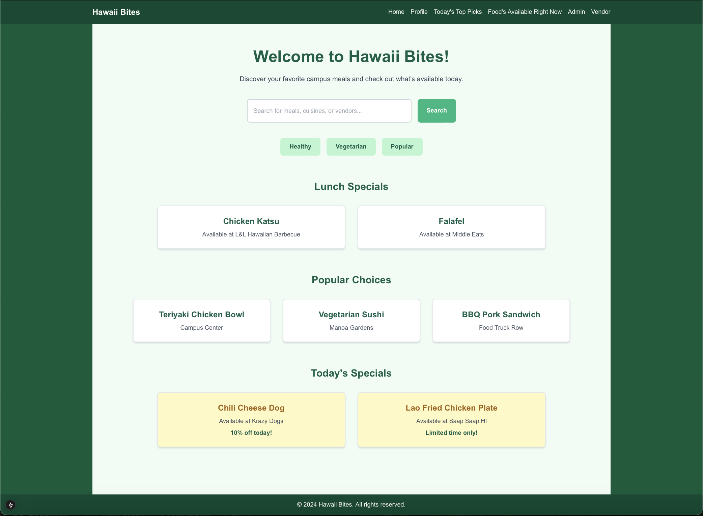
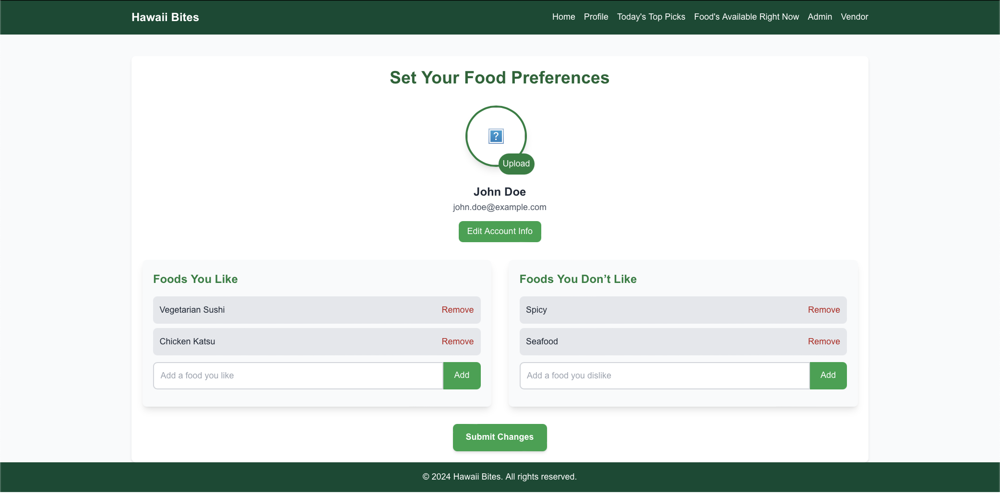

<!-- Page Header -->
<header style="display: flex; align-items: center; justify-content: center; margin-top: 20px;">
  
  <h1 style="color: #8B0000; font-size: 2.5em; font-family: 'Arial', sans-serif; margin: 0;">Hawaii Bites</h1>
</header>

Helping students find their favorite meals on campus.

---

<!-- Navigation -->
<section id="navigation" style="margin: 20px 0; padding: 20px;">
  <h2 style="text-align: left; color: #8B0000; font-family: 'Arial', sans-serif;">Navigation</h2>
  <nav style="margin: 10px 0; padding-left: 10px;">
    <ul style="list-style: none; padding: 0; margin: 0; font-size: 1em;">
      <li style="margin-bottom: 10px;">
        <a href="#overview" style="text-decoration: none; font-weight: bold; color: #8B0000;">Overview</a>
      </li>
      <li style="margin-bottom: 10px;">
        <a href="#github-organization" style="text-decoration: none; font-weight: bold; color: #8B0000;">GitHub Organization</a>
      </li>
      <li style="margin-bottom: 10px;">
        <a href="#issue-boards" style="text-decoration: none; font-weight: bold; color: #8B0000;">Issue Boards</a>
      </li>
      <li style="margin-bottom: 10px;">
        <a href="#team-contract-link" style="text-decoration: none; font-weight: bold; color: #8B0000;">Team Contract Link</a>
      </li>
      <li style="margin-bottom: 10px;">
        <a href="#screenshots" style="text-decoration: none; font-weight: bold; color: #8B0000;">Screenshots</a>
      </li>
      <li style="margin-bottom: 10px;">
        <a href="#meet-the-team" style="text-decoration: none; font-weight: bold; color: #8B0000;">Meet the Team</a>
      </li>
      <li style="margin-bottom: 10px;">
        <a href="#deployment" style="text-decoration: none; font-weight: bold; color: #8B0000;">Deployment</a>
      </li>
      <li style="margin-bottom: 10px;">
        <a href="#github-hosting-guidelines" style="text-decoration: none; font-weight: bold; color: #8B0000;">GitHub Hosting Guidelines</a>
      </li>
      <li style="margin-bottom: 10px;">
        <a href="#contact-us" style="text-decoration: none; font-weight: bold; color: #8B0000;">Contact Us</a>
      </li>
    </ul>
  </nav>
</section>

---

## Overview
Hawaii Bites provides a consolidated menu from all food vendors at the University of Hawaii, including food trucks, Campus Center, and Paradise Palms.

---

## GitHub Organization
- [Organization Page](https://github.com/hawaii-bites)

## Issue Boards (M1 , M2)
- [Milestone 1 (M1) Project Board](https://github.com/orgs/hawaii-bites/projects/6)  
- [Milestone 2 (M2) Project Board](https://github.com/orgs/hawaii-bites/projects/5/views/1)

## Team Contract Link
- [Team Contract Link](https://docs.google.com/document/d/1e0Z4KQ5d5ZOMLgAXoBlIeQKf8K3T6cgxiRi-02hE0eI/edit?usp=sharing)

---

## Up-to-date Screenshots

<!-- Up-to-date Screenshots Section -->
<section id="up-to-date-screenshots" style="padding: 20px;">
  <h2 style="text-align: center; color: #8B0000; font-family: 'Arial', sans-serif; margin-bottom: 20px;">Up-to-date Screenshots</h2>

  <!-- Navigation -->
  <nav style="margin: 20px 0; padding-left: 10px;">
    <h3 style="text-align: left; color: #8B0000; font-family: 'Arial', sans-serif;">Screenshots Navigation</h3>
    <ul style="list-style: none; padding: 0; margin: 0; font-size: 1em;">
      <li style="margin-bottom: 10px;">
        <a href="#landing-page" style="text-decoration: none; color: #065f46;">Landing Page</a>
      </li>
      <li style="margin-bottom: 10px;">
        <a href="#home-page" style="text-decoration: none; color: #065f46;">Home Page</a>
      </li>
      <li style="margin-bottom: 10px;">
        <a href="#todays-top-picks-page" style="text-decoration: none; color: #065f46;">Today's Top Picks</a>
      </li>
      <li style="margin-bottom: 10px;">
        <a href="#foods-available-right-now-page" style="text-decoration: none; color: #065f46;">Foods Available Right Now</a>
      </li>
      <li style="margin-bottom: 10px;">
        <a href="#user-profile-page" style="text-decoration: none; color: #065f46;">User Profile</a>
      </li>
      <li style="margin-bottom: 10px;">
        <a href="#admin-dashboard-page" style="text-decoration: none; color: #065f46;">Admin Dashboard</a>
      </li>
      <li style="margin-bottom: 10px;">
        <a href="#vendor-dashboard-page" style="text-decoration: none; color: #065f46;">Vendor Dashboard</a>
      </li>
    </ul>
  </nav>

  <!-- Landing Page -->
  

    <h3>Landing Page</h3>
    
The first look at Hawaii Bites, giving users an overview of the app's features and inviting them to explore the best food options on campus.

    
  

  <!-- Home Page -->
  

    <h3>Home Page</h3>
    
The main hub for users, showcasing popular food options, daily specials, and easy access to different sections of the app.

    
    
Screenshot Version 2:

    
  

  <!-- Today's Top Picks Page -->
  

    <h3>Today's Top Picks</h3>
    
Highlighting the most popular and trending food items for the day, curated based on user preferences and vendor updates.

    
  

  <!-- Foods Available Right Now Page -->
  

    <h3>Foods Available Right Now</h3>
    
A live feed of all food options currently available on campus, updated in real-time to help users find meals instantly.

    
  

  <!-- User Profile Page -->
  

    <h3>User Profile</h3>
    
Personalized user profile page where users can set their preferences, dietary restrictions, and save favorite food items.

    
    
Screenshot Version 2:

    
  

  <!-- Admin Dashboard Page -->
  

    <h3>Admin Dashboard</h3>
    
The Admin Dashboard provides comprehensive tools for managing the Hawaii Bites application. Admins can view and edit user profiles, manage vendor information, and maintain the consolidated menu directory. It ensures smooth operation and seamless user experience.

    
  

  <!-- Vendor Dashboard Page -->
  

    <h3>Vendor Dashboard</h3>
    
The Vendor Dashboard allows food vendors to manage their menu offerings and update their profile information. This dashboard helps vendors stay connected with customers and provide real-time updates on available items.

    
  

</section>

---

## Meet the Team - Woof!

  <!-- Column 1: Kanoa Borromeo -->
  

    <h2>Kanoa Borromeo</h2>
    
    

      Dominic “Kanoa” Borromeo is a rising senior, majoring in Computer Science at UH Manoa. Stepping away from D1 soccer in California allowed Kanoa to immerse himself in AI-related opportunities. Kanoa aspires to combine his CS and future JD degrees to help regulate AI policies.
    

  

  <!-- Column 2: Seth Ines -->
  

    <h2>Seth Ines</h2>
    
    

      Seth Ines is pursuing a Bachelor of Science in Computer Science within the Department of Information and Computer Sciences at the University of Hawaii. His career goal is to become a data analysis engineer, applying analytical and technical expertise to solve complex data challenges.
    

  

---

## Deployment

- [Deployment Application](https://hawaii-bites.vercel.app/)

---

## GitHub Hosting Guidlines

To ensure compliance with GitHub hosting guidelines for project management, we are actively adhering to their recommended practices across several dimensions of our project setup and development workflow. By hosting all source code necessary for building our application while excluding derived files, we ensure that new developers can easily set up the system without additional dependencies. We leverage a .gitignore file to prevent derived files like node_modules/ and other unnecessary artifacts (e.g., .DS_Store on Mac systems or development-specific settings files) from being included in our repository. This maintains a clean and efficient project structure and adheres to GitHub’s best practices for managing repositories.

Furthermore, our project utilizes a GitHub organization to centralize team-based development. By creating a dedicated organization with an appropriate and professional name, we streamline collaboration and maintain a cohesive identity for the project. All team members have been invited to the organization and granted "owner" status, ensuring equal participation and administrative access for efficient project management. Additionally, we have established two separate repositories under the organization: one for hosting the project’s documentation and public-facing home page (hawaii-bites.github.io) and another for application development. The index.md file in the documentation repository is designed to provide a comprehensive overview of the system, including user guides with screenshots, developer setup instructions, community feedback, development history, and contact details. This separation of concerns ensures that the documentation remains clear and accessible, while the application repository is optimized for active development.

By following these guidelines, we not only maximize the benefits of GitHub’s hosting features but also create a robust foundation for collaborative and professional project development.

---

## Contact Us

- **Email:** [hawaiibites@gmail.com](mailto:hawaiibites@gmail.com)  
- **GitHub:** [Hawaii Bites Organization](https://github.com/hawaii-bites/hawaii-bites.github.io)

