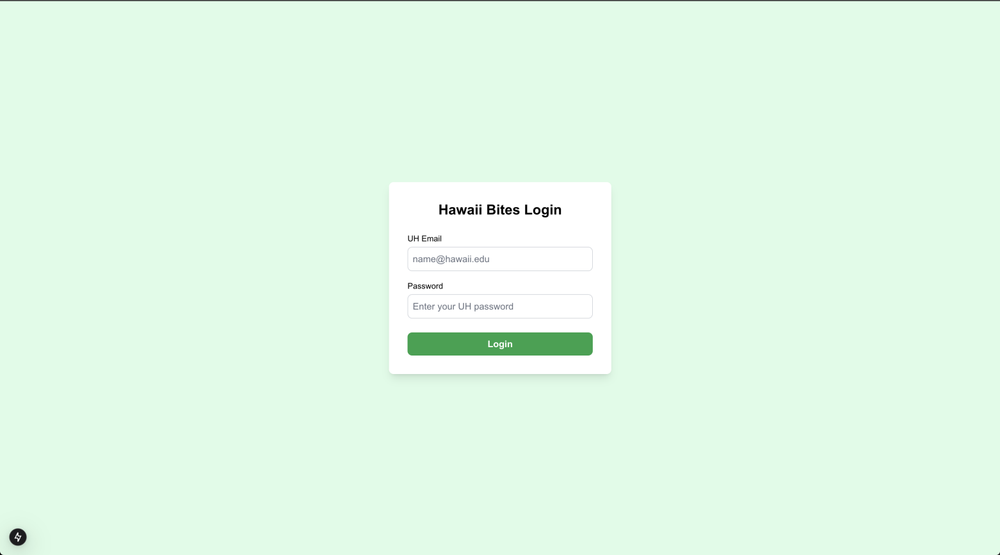
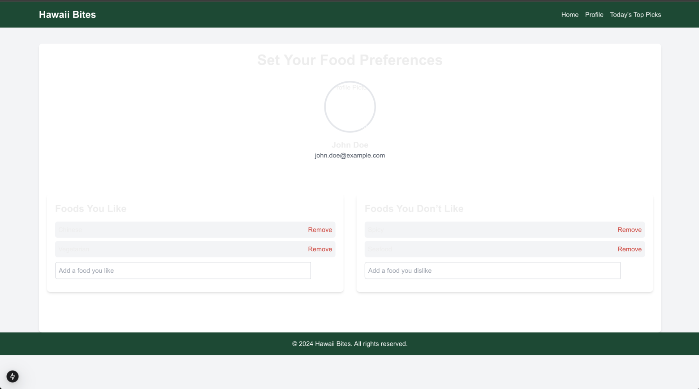
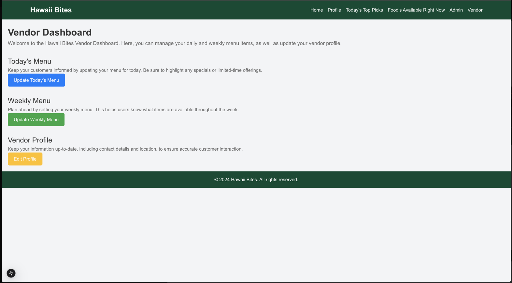

## Navigation
- [Landing Page](#landing-page)
- [Home Page](#home-page)
- [Today's Top Picks Page](#todays-top-picks-page)
- [Foods Available Right Now Page](#foods-available-right-now-page)
- [User Profile Page](#user-profile-page)
- [Admin Dashboard Page](#admin-dashboard-page)
- [Vendor Dashboard Page](#vendor-dashboard-page)

  <!-- Landing Page -->
  

    <h2>Landing Page</h2>
    

      The first look at Hawaii Bites, giving users an overview of the app's features and inviting them to explore the best food options on campus.
    

    
  

  <!-- Home Page -->
  

    <h2>Home Page</h2>
    

      The main hub for users, showcasing popular food options, daily specials, and easy access to different sections of the app.
    

    
  

  <!-- Today's Top Picks Page -->
  

    <h2>Today's Top Picks</h2>
    

      Highlighting the most popular and trending food items for the day, curated based on user preferences and vendor updates.
    

    
  

  <!-- Foods Available Right Now Page -->
  

    <h2>Foods Available Right Now</h2>
    

      A live feed of all food options currently available on campus, updated in real-time to help users find meals instantly.
    

    
  

  <!-- User Profile Page -->
  

    <h2>User Profile</h2>
    

      Personalized user profile page where users can set their preferences, dietary restrictions, and save favorite food items.
    

    
  

  <!-- Admin Dashboard Page -->
  

    <h2>Admin Dashboard</h2>
    

      The Admin Dashboard provides comprehensive tools for managing the Hawaii Bites application. Admins can view and edit user profiles, manage vendor information, and maintain the consolidated menu directory. It ensures smooth operation and seamless user experience.
    

    
  

  <!-- Vendor Dashboard Page -->
  

    <h2>Vendor Dashboard</h2>
    

      The Vendor Dashboard allows food vendors to manage their menu offerings and update their profile information. This dashboard helps vendors stay connected with customers and provide real-time updates on available items.
    

    
  

